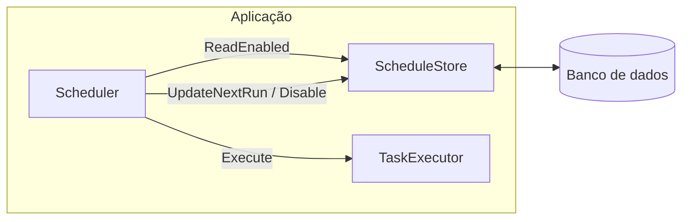

# scheduletasks – Scheduler de tarefas em Go

Biblioteca Go para agendar tarefas **one-shot** ou **recorrentes**, com store e executor injetáveis. Ideal para integrar numa aplicação que já possui persistência (ex.: PostgreSQL) e lógica de execução (filas, HTTP, etc.).

## Requisitos e instalação

- **Go 1.21+** (ver [go.mod](go.mod)).

```bash
go get scheduletasks
```

Se usar um caminho de repositório diferente, use esse caminho no lugar de `scheduletasks`.

## Conceitos principais

- **ScheduleTask** ([scheduler/types.go](scheduler/types.go)): representa uma tarefa agendada. Campos: `ID`, `StartAt`, `NextRunAt`, `LastRun`, `IntervalMinutes`, `Enabled`.  
  - **One-shot**: `IntervalMinutes <= 0` — após executar, o scheduler chama `Disable` no store.  
  - **Recorrente**: `IntervalMinutes > 0` — após executar, chama `UpdateNextRun` com a próxima execução.

- **ScheduleStore**: interface que fornece leitura e atualização das tarefas. Em produção é normalmente implementada com banco de dados.  
  - `ReadEnabled(ctx)` — devolve todas as tarefas com `Enabled == true`.  
  - `UpdateNextRun(ctx, id, nextRun, lastRun)` — atualiza próxima execução e última execução (tarefas recorrentes).  
  - `Disable(ctx, id, lastRun)` — desativa a tarefa e regista última execução (one-shot).

- **TaskExecutor**: interface que executa uma tarefa.  
  - `Execute(ctx, ScheduleTask) error` — chamado pelo scheduler para cada tarefa que está due.

## Exemplo mínimo de uso

A aplicação implementa `ScheduleStore` e `TaskExecutor` (em testes há um exemplo com stubs em [scheduler/example_test.go](scheduler/example_test.go)). Exemplo de integração:

```go
package main

import (
	"context"
	"os"
	"os/signal"
	"time"

	"scheduletasks/scheduler"
)

func main() {
	// db := ... (aberto pela aplicação, ex.: sql.Open("postgres", connStr))
	store := NewMyStore(db)   // exemplo completo em "5.1 Exemplo de implementação"
	exec := NewMyExecutor()   // sua implementação (ex.: enfileirar job ou chamar HTTP)

	s := scheduler.NewScheduler(store, exec,
		scheduler.WithWorkers(5),
		scheduler.WithResyncInterval(30*time.Second),
		scheduler.WithWakeupEarly(200*time.Millisecond),
	)

	ctx, cancel := context.WithCancel(context.Background())
	go s.Run(ctx)

	// Quando a agenda for alterada (ex.: API CRUD), notificar para re-ler sem esperar o resync:
	// s.NotifyScheduleChanged()

	quit := make(chan os.Signal, 1)
	signal.Notify(quit, os.Interrupt)
	<-quit
	cancel()
	// Aguardar s.Run(ctx) terminar (ex.: com sync.WaitGroup na aplicação)
}
```

- **NewScheduler(store, exec, opts...)** — constrói o scheduler; opções: `WithWorkers`, `WithResyncInterval`, `WithWakeupEarly`.
- **Run(ctx)** — bloqueia enquanto o scheduler está ativo; retorna quando `ctx` é cancelado.
- **NotifyScheduleChanged()** — sinaliza re-leitura imediata da agenda (útil após criar/editar tarefas noutro ponto da aplicação).

## Uso em produção

### 5.1 Implementar ScheduleStore (banco de dados)

Use uma tabela compatível com os campos de `ScheduleTask`. Exemplo de schema (PostgreSQL):

```sql
CREATE TABLE scheduled_tasks (
	id               SERIAL PRIMARY KEY,
	start_at         TIMESTAMPTZ NOT NULL,
	next_run_at      TIMESTAMPTZ,
	last_run         TIMESTAMPTZ,
	interval_minutes INT NOT NULL DEFAULT 0,
	enabled          BOOLEAN NOT NULL DEFAULT true
);
```

- **ReadEnabled**: `SELECT` das colunas acima onde `enabled = true`; mapear cada linha para `scheduler.ScheduleTask`. Para a primeira execução, se `next_run_at` for NULL, o scheduler usa `start_at`.
- **UpdateNextRun**: `UPDATE scheduled_tasks SET next_run_at = $1, last_run = $2 WHERE id = $3` (tarefas recorrentes).
- **Disable**: `UPDATE scheduled_tasks SET enabled = false, last_run = $1 WHERE id = $2` (one-shot).

Use transações e timeouts conforme o seu banco e garanta que todos os métodos respeitam o `context.Context` (cancelamento e deadline).

#### Exemplo de implementação

Exemplo com PostgreSQL e `database/sql`; pode ser adaptado a outros drivers (importe o driver, ex.: `_ "github.com/lib/pq"`, e use `sql.Open("postgres", connStr)` para obter `*sql.DB`). A aplicação abre a conexão e passa-a a `NewMyStore(db)`.

```go
package myapp

import (
	"context"
	"database/sql"
	"time"

	"scheduletasks/scheduler"
)

// DBStore implementa scheduler.ScheduleStore com PostgreSQL (ou outro DB via database/sql).
type DBStore struct {
	db *sql.DB
}

// NewMyStore devolve um ScheduleStore que usa a conexão db. A aplicação abre db (ex.: sql.Open("postgres", connStr)).
func NewMyStore(db *sql.DB) *DBStore {
	return &DBStore{db: db}
}

// ReadEnabled devolve todas as tarefas com enabled = true.
func (s *DBStore) ReadEnabled(ctx context.Context) ([]scheduler.ScheduleTask, error) {
	rows, err := s.db.QueryContext(ctx,
		`SELECT id, start_at, next_run_at, last_run, interval_minutes, enabled
		 FROM scheduled_tasks WHERE enabled = true`)
	if err != nil {
		return nil, err
	}
	defer rows.Close()

	var tasks []scheduler.ScheduleTask
	for rows.Next() {
		var t scheduler.ScheduleTask
		var nextRun, lastRun sql.NullTime
		err := rows.Scan(&t.ID, &t.StartAt, &nextRun, &lastRun, &t.IntervalMinutes, &t.Enabled)
		if err != nil {
			return nil, err
		}
		if nextRun.Valid {
			t.NextRunAt = nextRun.Time
		}
		if lastRun.Valid {
			t.LastRun = &lastRun.Time
		}
		tasks = append(tasks, t)
	}
	return tasks, rows.Err()
}

// UpdateNextRun atualiza next_run_at e last_run (tarefas recorrentes).
func (s *DBStore) UpdateNextRun(ctx context.Context, id int, nextRun, lastRun time.Time) error {
	_, err := s.db.ExecContext(ctx,
		`UPDATE scheduled_tasks SET next_run_at = $1, last_run = $2 WHERE id = $3`,
		nextRun, lastRun, id)
	return err
}

// Disable desativa a tarefa e regista last_run (one-shot).
func (s *DBStore) Disable(ctx context.Context, id int, lastRun time.Time) error {
	_, err := s.db.ExecContext(ctx,
		`UPDATE scheduled_tasks SET enabled = false, last_run = $1 WHERE id = $2`,
		lastRun, id)
	return err
}
```

### 5.2 Implementar TaskExecutor

Em produção, `Execute` pode:

- Enfileirar jobs (Redis, SQS, etc.) para workers processarem.
- Publicar eventos ou chamar APIs HTTP/internas.
- Executar a lógica diretamente (se for rápida e segura em goroutine).

Se `Execute` retornar erro, o scheduler apenas regista o erro em log; não faz retry. A aplicação pode implementar retry/alerting na sua lógica ou na fila.

### 5.3 Opções recomendadas

| Opção | Default | Uso em produção |
|-------|--------|------------------|
| `WithWorkers(n)` | 5 | Ajustar conforme carga e limites do store/executor (conexões DB, rate limits). |
| `WithResyncInterval(d)` | 30s | Re-ler o store a cada `d`; 30s é razoável; reduzir se precisar de reação mais rápida a mudanças. |
| `WithWakeupEarly(d)` | 200ms | Acordar um pouco antes do próximo `next_run_at` para reduzir atraso; manter baixo para não disparar cedo demais. |

### 5.4 Graceful shutdown

1. Criar um `context.Context` cancelável (ex.: `context.WithCancel`) e passá-lo a `Run(ctx)`.
2. No shutdown da aplicação (SIGTERM/SIGINT), chamar `cancel()`.
3. Aguardar a goroutine que chama `s.Run(ctx)` terminar: o scheduler fecha o canal de tarefas, espera os workers acabarem e depois `Run` retorna.
4. Não encerrar o processo antes disso para evitar interromper tarefas a meio.

### 5.5 Atualizações da agenda

Quando a aplicação alterar tarefas (CRUD) via API ou outro processo, chame `s.NotifyScheduleChanged()`. O scheduler re-lê o store no próximo ciclo, sem esperar o próximo tick de `WithResyncInterval`.

### 5.6 Uma instância por base de agenda

O scheduler **não** implementa lock distribuído. Para evitar execução duplicada da mesma tarefa, recomenda-se que apenas **uma instância** do processo (por ambiente/deploy) rode `Run()` para uma mesma base de tarefas. Se tiver múltiplas réplicas, use mecanismo externo (ex.: leader election) para decidir qual instância chama `Run()`.

### 5.7 Observabilidade

O pacote usa o `log` padrão de Go (início do scheduler, erros de store/executor, execução de tarefas, reset). Em produção, configure o logger da aplicação (nível, formato JSON, métricas) conforme o ambiente; o output do scheduler segue o logger configurado para o binário.

## Fluxo do scheduler



1. A aplicação inicia o **Scheduler** com **Store** (ex.: DB) e **Executor**.
2. **Run(ctx)** em loop: lê tarefas habilitadas → dorme até ao próximo `next_run_at` → re-lê → envia tarefas due para o canal → workers executam e chamam `Store.UpdateNextRun` ou `Store.Disable`.
3. Shutdown: `ctx` cancelado → canal fechado → workers terminam → `Run` retorna.

## Estrutura do repositório

- **scheduler/** — tipos (`ScheduleTask`, interfaces), `NewScheduler`, `Run`, `NotifyScheduleChanged`, opções (`WithWorkers`, `WithResyncInterval`, `WithWakeupEarly`). Ver [scheduler/scheduler.go](scheduler/scheduler.go) e [scheduler/types.go](scheduler/types.go).
- **scheduler/example_test.go** — testes e exemplo com stubs (one-shot vs recorrente, uso de `NotifyScheduleChanged`).

## Licença

Ver repositório.
